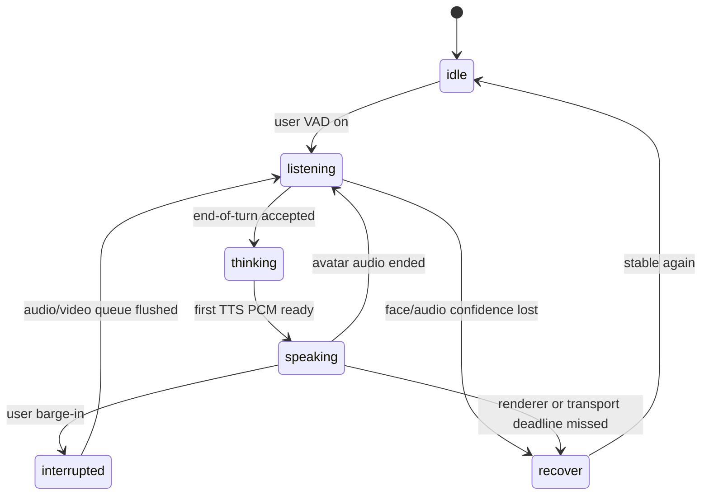

# Behavior Control Protocol v0.1

마지막 확인: **2026-08-25**  
상태: 설계 초안 — 구현 전

## 목적

LLM의 문장, 사용자의 카메라·마이크 신호, 립싱크 모델을 직접 연결하면 렌더러를 바꿀 때마다 전체 시스템을 다시 만든다. 이 프로토콜은 **무엇을 언제 움직일지**와 **그 픽셀을 어떻게 만들지**를 분리한다.

- 정책 계층은 `고개를 420ms 동안 작게 끄덕인다`고 명령한다.
- Ditto adapter는 이를 pose delta와 expression delta로 변환한다.
- MuseTalk + LivePortrait adapter는 대응 motion primitive를 선택하고 입을 마지막에 합성한다.
- 향후 generative video adapter는 같은 명령을 conditioning signal로 사용한다.

프로토콜의 기준 시계는 **출력 오디오의 presentation timestamp(PTS)** 다. 비디오 프레임 번호나 서버 wall clock을 기준으로 삼지 않는다.

## 경계

### 입력: 관찰 가능한 신호

`PerceptionFrame`은 사용자의 정체성·심리 상태가 아니라 관찰 가능한 저수준 신호와 불확실성을 전달한다.

```json
{
  "session_id": "s_123",
  "seq": 481,
  "captured_at_ms": 9120,
  "audio": {
    "vad": true,
    "rms_db": -21.4,
    "pitch_hz": 167.3,
    "speaking_rate": 4.1,
    "confidence": 0.93
  },
  "face": {
    "present": true,
    "yaw_deg": -4.2,
    "pitch_deg": 2.8,
    "roll_deg": 0.5,
    "eye_open_l": 0.81,
    "eye_open_r": 0.79,
    "gaze_x": -0.08,
    "gaze_y": 0.03,
    "smile": 0.11,
    "brow_inner_up": 0.24,
    "jaw_open": 0.02,
    "confidence": 0.76
  },
  "transport": {
    "rtt_ms": 42,
    "camera_fps": 12
  }
}
```

원칙:

- 브라우저에서 MediaPipe Face Landmarker 같은 on-device 추론을 수행하고 파생 feature만 전송한다.
- 원본 카메라/마이크 저장은 연구 참여에 별도로 동의한 세션에만 허용한다.
- `sad`, `angry`, `depressed` 같은 단정적 레이블은 perception 계약에 넣지 않는다.
- face confidence가 낮거나 얼굴이 없으면 해당 값은 `null`로 보내며 직전 값을 무기한 유지하지 않는다.
- 사용자 발화 내용·자기보고·대화 맥락이 시각 추정보다 우선한다.

### 내부 상태: 대화와 행동의 근거

`InteractionState`는 다음 신호를 함께 사용한다.

| 신호 | 예시 | 신뢰 우선순위 |
|---|---|---:|
| 명시적 사용자 표현 | “오늘 정말 슬퍼요” | 1 |
| 턴 상태 | speaking, yielding, interrupted | 1 |
| 대화 문맥 | 위로가 필요한 사건, 농담 맥락 | 2 |
| 음성 관찰 | VAD, pitch 변화, 속도, pause | 3 |
| 얼굴 관찰 | head pose, blink, gaze proxy, action unit proxy | 4 |
| 모델의 감정 추정 | 확률적 가설 | 5 |

낮은 순위가 높은 순위와 충돌하면 버린다. 예를 들어 사용자가 상실을 말하는데 face model이 `smile=0.3`을 내더라도 아바타가 크게 웃지 않는다.

## 출력 계약

`BehaviorFrame`은 10Hz로 계획되고 renderer adapter에서 25/30fps로 보간한다. 이벤트형 nod/blink와 연속형 pose/expression을 모두 지원한다.

```json
{
  "schema": "behavior.v0.1",
  "session_id": "s_123",
  "turn_id": "t_19",
  "seq": 92,
  "pts_ms": 3680,
  "duration_ms": 100,
  "mode": "listening",
  "speech": {
    "jaw": 0.0,
    "viseme": null,
    "phoneme": null,
    "energy": 0.0
  },
  "expression": {
    "valence": -0.18,
    "arousal": -0.05,
    "intensity": 0.26,
    "coefficients": {
      "browInnerUp": 0.12,
      "mouthSmileLeft": 0.0,
      "mouthSmileRight": 0.0
    }
  },
  "head": {
    "yaw_deg": 1.2,
    "pitch_deg": 3.8,
    "roll_deg": 0.2
  },
  "gaze": {
    "x": 0.0,
    "y": -0.03,
    "target": "user"
  },
  "blink": {
    "left": 0.05,
    "right": 0.05
  },
  "events": [
    {
      "type": "nod",
      "id": "n_44",
      "start_pts_ms": 3700,
      "duration_ms": 440,
      "amplitude_deg": 5.5,
      "repetitions": 1,
      "shape": "ease_in_out"
    }
  ],
  "provenance": {
    "source": "turn_policy",
    "confidence": 0.82,
    "priority": 60,
    "expires_at_ms": 4700,
    "reason_code": "acknowledge_user"
  }
}
```

### 범위와 단위

| 필드 | 범위 | 의미 |
|---|---:|---|
| `valence`, `arousal` | -1…1 | 정서의 연속 좌표; 표정 그 자체가 아님 |
| `intensity` | 0…1 | 전체 expression 적용 강도 |
| expression coefficient | 0…1 | ARKit 이름을 우선 사용하되 adapter mapping 필수 |
| yaw/pitch/roll | degree | 아바타 neutral 좌표계 기준 delta |
| gaze x/y | -1…1 | 눈 영역에서 정규화한 목표 offset |
| blink left/right | 0…1 | 0=open, 1=closed |
| `pts_ms` | integer | turn의 첫 출력 PCM sample을 0으로 한 media time |

`FLAME` 계수나 모델 고유 latent index를 공통 계약에 노출하지 않는다. 그것은 renderer adapter 내부 mapping이다.

## 상태기계



| mode | 기본 행동 | 금지/제한 |
|---|---|---|
| `idle` | 느린 blink, 매우 작은 자세 변화 | 반복 nod, 큰 표정 |
| `listening` | 사용자 방향 gaze, backchannel 후보 | lip motion, 자동 미소 남발 |
| `thinking` | 짧은 gaze shift, 작은 breath motion | 장시간 freeze, 반복 고개 흔들기 |
| `speaking` | TTS prosody 기반 lip/jaw, 문장 경계 gesture | 사용자 반응을 복사하는 mimicry |
| `interrupted` | 입과 발화를 즉시 중단, attentive neutral | 이전 turn의 잔여 프레임 |
| `recover` | neutral loop, 오류 은폐가 아닌 상태 보고 | 과한 표정, stale command |

## 명령 우선순위와 합성

높은 숫자가 우선한다.

| priority | 공급자 | 예시 |
|---:|---|---|
| 100 | safety/manual | 운영자 neutral 강제, avatar freeze |
| 90 | interruption | lip close, stale queue flush |
| 80 | gaze/attention | 얼굴이 있을 때 사용자 방향 응시 |
| 70 | speech articulation | phoneme/viseme/jaw |
| 60 | turn reaction | acknowledgment nod, concern expression |
| 40 | discourse gesture | 문장 강조, gaze beat |
| 20 | idle motion | blink, breathing, micro sway |

합성 규칙:

1. 동일 채널의 겹치는 명령은 높은 priority가 덮어쓴다.
2. 같은 priority면 최신 `seq`가 우선한다.
3. lip/jaw는 TTS alignment가 독점한다. 감정 정책은 입꼬리·볼 계수를 제한적으로 수정할 수 있지만 phoneme closure를 깨면 안 된다.
4. head gesture와 gaze는 더할 수 있으나 최종 physical limits를 통과한다.
5. `expires_at_ms`가 지난 명령은 보간하지 않고 neutral로 decay한다.
6. renderer가 지원하지 않는 채널은 조용히 버리지 않고 telemetry에 `unsupported_control`로 기록한다.

## 안전한 motion limits 초깃값

아래 값은 제품 규격이 아니라 **[H] 첫 로컬 튜닝을 위한 보수적 시작점**이다.

| 채널 | speaking/listening 권고 범위 | 변화율 제한 |
|---|---:|---:|
| yaw | ±12° / ±8° | 35°/s |
| pitch | -8…10° / -6…9° | 30°/s |
| roll | ±5° | 20°/s |
| gaze x/y | ±0.35 | 1.2 normalized/s |
| nod amplitude | 3…8° | event duration 320…700ms |
| expression intensity | 0…0.55 | attack ≥160ms, release ≥220ms |

모든 continuous channel은 critically damped filter 또는 jerk-limited spline을 거친다. 프레임마다 독립 샘플링한 random motion은 쓰지 않는다.

## 문맥-표정 모순 방지

LLM은 발화 텍스트와 turn-level intent만 제안하며 최종 얼굴 계수를 직접 생성하지 않는다. 정책 계층이 다음 guard를 적용한다.

```text
explicit_user_state > conversational_context > user_observation > model_guess

if context in {loss, fear, apology, complaint} and humor_explicit is false:
    smile_cap = 0.08
    positive_valence_cap = 0.05
    allowed = {neutral_attentive, concern_soft, empathy_low_arousal}

if confidence < 0.55:
    decay_to = neutral_attentive
```

추가 규칙:

- 사용자 표정을 그대로 따라 하지 않는다. 반응은 역할과 문맥에 맞아야 한다.
- “슬프다”는 말을 들었을 때 `concern`을 선택할 수 있지만 사용자가 슬픈 사람이라고 저장하지 않는다.
- polite smile은 강도와 지속 시간을 제한하고 심각한 맥락에서는 비활성화한다.
- LLM이 생성한 emotion tag가 safety guard와 충돌하면 tag를 폐기하고 reason code를 남긴다.

## nod 정책 v0

초기 버전은 학습 모델보다 설명 가능한 규칙으로 시작한다.

### 후보 생성

- 사용자가 600ms 이상 말하고 있으며 clause boundary가 감지됨
- 사용자가 확인을 요청하거나 중요한 사실을 전달함
- 아바타가 “네”, “그렇군요”, 짧은 backchannel을 말함
- 사용자의 pause가 250–700ms이고 발화권을 빼앗으면 안 되는 상태

### 억제

- 최근 nod 종료 후 1.8초 이내
- 얼굴/음성 confidence 저하
- 사용자가 질문을 끝내지 않았고 큰 movement가 주의를 빼앗을 수 있음
- negative/high-stakes 맥락에서 빠른 반복 nod
- 렌더러 queue가 latency budget을 초과함

### 형태

- acknowledgment: 1회, 4–6°, 380–520ms
- agreement: 1–2회, 5–8°, 500–750ms
- thinking/uncertain: nod 대신 작은 tilt나 neutral 유지

이 규칙을 로그로 축적한 뒤 [데이터·학습 로드맵](../03-roadmap/DATA_AND_TRAINING_ROADMAP.md)의 lightweight nod policy 학습으로 교체한다.

## 렌더러별 adapter 계약

```text
prepare(avatar_asset) -> RendererCapabilities
start_turn(turn_id, audio_clock) -> TurnHandle
push_audio(pcm_chunk, pts_ms)
push_behavior(behavior_frame)
cancel_before(generation_id)
frames() -> video_frame + pts_ms + applied_control_trace
close_turn(reason)
```

### MuseTalk + LivePortrait

- LivePortrait가 만든 avatar-specific motion primitive/sequence를 base frame으로 고른다.
- MuseTalk는 선택된 base frame의 입 영역을 audio condition으로 마지막에 합성한다.
- 현재 저장소의 고정 `talking.pkl` loop를 `neutral`, `listen`, `nod_small`, `blink`, `glance`, `concern_soft` bank로 확장한다.
- primitive 전환은 가능한 한 silence/phoneme boundary에서 하고 4–8 frame crossfade 또는 latent-compatible interpolation을 검증한다.
- 지원하지 못한 arbitrary control은 capability bit와 telemetry로 드러낸다.

### Ditto

- 현재 vendor code에 존재하는 per-frame `delta_pitch`, `delta_yaw`, `delta_roll`, `delta_exp` 지점을 adapter에 연결한다.
- 먼저 작은 amplitude의 deterministic sweep로 부호·단위·identity drift를 calibration한다.
- audio-driven motion과 external pose가 충돌할 때 external control은 residual로 제한한다.
- frame sink와 GPU thread 취소가 실제로 안전해진 뒤 제품 후보로 승격한다.

### 향후 generative video

- 같은 behavior timeline을 pose map, keypoint, expression embedding, control token 등의 conditioning으로 변환한다.
- 모델이 25fps보다 느리면 lookahead를 늘리는 대신 barge-in SLO를 깨지 않는지 평가한다.
- 모델 출력에 applied-control trace가 없더라도 입력 command와 추출된 output pose를 비교해 adherence를 측정한다.

## 취소와 stale-frame 규칙

각 turn에는 단조 증가하는 `generation_id`가 있다.

1. barge-in 시 오디오 publisher를 먼저 mute한다.
2. TTS·renderer 입력 queue에서 이전 generation을 제거한다.
3. GPU 작업이 즉시 중단되지 않더라도 결과 frame의 generation을 확인해 publish하지 않는다.
4. Python `Task.cancel()`을 GPU thread 중단으로 간주하지 않는다.
5. 이전 turn의 frame이 새 turn 뒤에 한 장이라도 보이면 테스트 실패다.

## capability negotiation

렌더러는 준비 단계에서 다음을 반환한다.

```json
{
  "renderer": "musetalk_liveportrait",
  "fps": 25,
  "streaming_audio": false,
  "controls": {
    "lip": "audio_driven",
    "head_pose": "primitive_bank",
    "gaze": "primitive_bank",
    "expression": "primitive_bank",
    "nod": "event",
    "blink": "event"
  },
  "max_concurrent_turns": 1,
  "calibration_id": "avatar_42-v3"
}
```

정책은 capability를 보고 명령을 낮춰 보낸다. 예를 들어 gaze가 없으면 고개 방향으로 대체할 수 있지만, 해당 downgrade를 기록한다.

## 관측성

각 출력 프레임에는 최소한 다음 trace를 연결한다.

- session/turn/generation/PTS
- perception snapshot hash
- policy reason code와 confidence
- 요청 control과 adapter가 실제 적용한 control
- renderer queue wait, inference, encode, network time
- output에서 재추출한 pose/gaze/expression
- stale/drop/downgrade 여부

이 trace가 있어야 “슬픈 말에 웃었다”가 LLM 계획, guard, adapter, 모델 drift 중 어디서 발생했는지 진단할 수 있다.

## 버전 정책

- `behavior.v0.x`: 필드를 추가할 수 있으나 의미는 유지한다.
- 필드 의미나 좌표계가 바뀌면 major를 올린다.
- 저장 로그에는 schema version과 renderer calibration version을 함께 남긴다.
- schema fixture와 golden timeline은 [평가·벤치마크 계획](../03-roadmap/EVALUATION_AND_BENCHMARK.md)에 따라 CI에서 검증한다.
