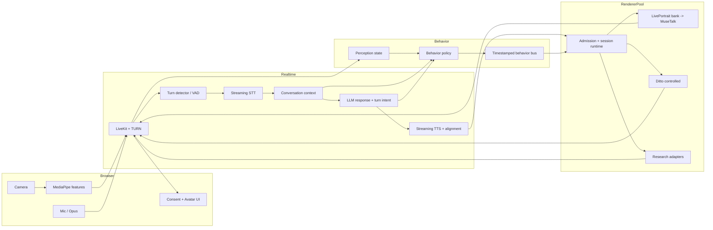

# 단기 구현 설계: 실시간 empathic generative avatar

마지막 확인: **2026-08-25**  
목표 범위: 단일 GPU·단일 아바타의 연구 PoC에서 시작해, 측정 가능한 full-duplex 서비스 골격까지

## 0. 결정 요약

### 채택

1. **LiveKit/WebRTC를 media plane으로 사용**한다. 오디오를 master clock으로 하고 영상·제어 이벤트에 PTS를 붙인다.
2. 카메라는 브라우저에서 **MediaPipe Face Landmarker 계열로 on-device 분석**하고, 기본적으로 파생 feature만 보낸다.
3. LLM은 문장과 turn-level intent를 만들되 얼굴 관절을 직접 생성하지 않는다. **deterministic behavior policy**가 표정·머리·시선·nod를 계획한다.
4. [Behavior Control Protocol](BEHAVIOR_CONTROL_PROTOCOL.md)을 렌더러와 독립된 계약으로 만든다.
5. 제품 bridge는 **LivePortrait motion primitive를 먼저 적용하고 MuseTalk가 입을 마지막에 합성**하는 현재 아이디어를 확장한다.
6. 동시에 **Ditto의 이미 존재하는 pose/expression control hook**을 연결해 unified renderer 후보로 A/B한다.
7. 첫 6주의 성공 기준은 데모 영상이 아니라 latency, A/V sync, control adherence, 문맥-표정 일치성이다.

### 보류

- Avatar Forcing, PersonaLive, EmpaAva, 대형 streaming video diffusion을 제품 의존성으로 넣는 것
- end-to-end 자체 모델 학습
- raw camera의 상시 서버 업로드·저장
- “감정 인식 결과”를 곧바로 표정으로 복사하는 정책

## 1. 현재 저장소의 실제 상태

이 표는 목표 문서가 아니라 2026-08-25 공유 작업 트리와 로컬 실행 흔적을 감사한 결과다.

| 영역 | 현재 상태 [L] | 목표와의 차이 |
|---|---|---|
| 사용자 입력 | 브라우저 `getUserMedia({audio})`, Web Speech 결과 텍스트 | 카메라, raw audio, prosody, VAD, gaze/head/expression 없음 |
| 대화 문맥 | persona + 현재 `user_text`; Ollama `stream:false` | 과거 turn, 부분 transcript, tool/event context 없음 |
| TTS | 전체 문장을 `eSpeak` WAV로 만든 뒤 렌더 시작 | streaming PCM·phoneme/viseme timing 없음 |
| MuseTalk 경로 | 현재 공유 트리에는 LivePortrait의 한 `talking.pkl` loop를 미리 생성해 MuseTalk base frames로 순환하는 코드가 있음 | 문맥/카메라/행동 명령으로 primitive를 선택하지 못함; arbitrary pose/gaze 제어 아님 |
| Ditto 경로 | vendor code에 frame별 pitch/yaw/roll, expression delta hook 존재 | worker가 `ctrl_info`를 전달하지 않음 |
| 전송 | REST control + 별도 MJPEG ``와 WAV `<audio>` | 하나의 media clock, jitter buffer, congestion control 없음 |
| 동시성 | renderer별 global lock | worker당 실질 render concurrency 1 |
| 중단 | `asyncio.Task.cancel()` 중심 | CUDA thread는 계속 돌 수 있고 stale frame 방지 token 없음 |
| 삭제 | DB/일부 파일 중심 | GPU cache, turn dict, WAV의 완전한 삭제 계보 없음 |
| readiness | `/health`가 모델/CUDA/asset을 검증하지 않음 | admission과 장애 격리가 불가 |
| 재현성 | main에 commit 없음, 전 파일 untracked; Ditto patch 손상·compose path 불일치 | 기준선, rollback, 새 host 재현 불가 |

중요한 로컬 수치:

- [L] RTX 5090 실행 로그에서 성공한 MuseTalk turn의 내부 first frame은 0.108–0.861초였다. 이 수치는 LLM과 전체 TTS 시간을 포함하지 않는다.
- [L] 311 frames/12.475초 audio를 실제 emit하는 데 약 14.67초가 걸려 실효 약 21.4fps, audio 대비 약 1.9–2.2초 지연 가능성이 관찰됐다.
- [L] frame pacing이 inference와 같은 worker 경로에 있고, audio 종료 시 브라우저가 영상을 제거하므로 말미 frame이 잘릴 수 있다.
- [L] 테스트는 API 3개, web 2개뿐이며 GPU/stream/cancel/A/V/control 테스트는 없다.

따라서 “현재 렌더러 first frame”을 제품 latency로 보고해서는 안 된다. 기준은 사용자가 말하기를 끝낸 시점 또는 barge-in 시점부터 브라우저에서 audio/video가 실제 표시된 시점까지다.

### 기능 개발 전에 닫을 P0/P1

| 우선순위 | 문제 [L] | 영향 | 완료 조건 |
|---|---|---|---|
| P0 | main branch에 commit이 없고 전 파일 untracked | diff/rollback/reproduction 불가 | 사용자 변경 검토 후 첫 기준 commit/tag와 dirty-free benchmark |
| P0 | Ditto 배포 patch가 `git apply --stat`에서 corrupt; 실제 vendor diff 일부 누락 | 새 host에서 재현 불가 | pinned upstream에서 생성한 patch가 clean apply되고 hash 일치 |
| P0 | compose의 Ditto model path가 실제 mount 하위 경로와 불일치 | `ditto_live` 전환 실패 | container readiness에서 model/config/weight 모두 검증 |
| P0 | `Task.cancel()`이 `to_thread` CUDA 작업을 멈추지 않는데 lock은 풀릴 수 있음 | 동일 engine 동시 접근, stale frame, crash | generation filter + process isolation + 100회 interrupt 통과 |
| P0 | API token은 fetch header에만 붙고 `/<audio>` direct request에는 붙지 않음 | production token을 켜면 media 401 가능 | WebRTC auth 또는 signed media path E2E 테스트 |
| P1 | renderer global lock과 session 없는 cancel이 모든 active turn에 영향 | 실질 동시성 1, cross-session 취소 | session-owned runtime/admission/cancel |
| P1 | live 경로가 전달된 audio/voice 대신 전체 eSpeak WAV를 다시 생성 | voice 선택 무시, streaming 불가 | timestamped PCM을 단일 source로 사용 |
| P1 | delete가 GPU avatar cache, turn dict, WAV/파생 asset을 완전히 지우지 않음 | privacy/VRAM/disk 누수 | lineage 기반 delete와 cache/WAV 검증 |
| P1 | health가 model/CUDA/asset/dry-run을 확인하지 않음 | healthy 뒤 첫 prepare 500 | readiness와 liveness 분리 |
| P1 | worker/GPU/cancel/sync test가 없음 | 품질 회귀 탐지 불가 | 최소 nightly GPU golden suite |

이 결함들은 새 표정 모델의 품질과 독립적이다. 먼저 닫지 않으면 어떤 renderer를 넣어도 서비스성 평가가 왜곡된다.

## 2. 목표 아키텍처



### control plane과 media plane 분리

- **control plane**: avatar 등록/준비/권리/세션 생성/renderer capability/admission/삭제
- **media plane**: Opus PCM, video track, data channel의 perception/behavior event
- 기존 FastAPI `AvatarRenderer`/`RemoteRenderer` 경계와 `/prepare`, `/render`, `/cancel` 개념은 control plane의 출발점으로 살린다.
- `` MJPEG와 `<audio>` URL은 디버그 fallback으로만 남기고 제품 경로에서 제거한다.

## 3. 사용자 perception 설계

### 브라우저에서 처리할 것

[MediaPipe Face Landmarker 공식 문서](https://ai.google.dev/edge/mediapipe/solutions/vision/face_landmarker)는 3D landmarks, blendshape score, facial transform matrix를 제공한다 [O]. 브라우저 목표 sampling은 10–15Hz다. 렌더 fps와 같을 필요가 없다.

전송 feature:

- face presence/quality/confidence
- head yaw/pitch/roll
- eye openness, blink event
- gaze proxy x/y와 `looking_at_screen` 확률
- smile, brow inner up/down, jaw open 등 제한된 action-unit proxy
- capture timestamp와 camera fps

서버/agent audio feature:

- VAD, turn start/end, pause length
- RMS/energy, F0와 변화량, speaking rate
- partial transcript와 word timestamp
- packet loss/RTT/quality

[Silero VAD](https://github.com/snakers4/silero-vad)는 MIT 라이선스의 경량 VAD 후보 [O]이고, [LiveKit turn handling](https://docs.livekit.io/agents/logic/turns/)은 STT endpointing, VAD, turn detector와 interruption을 결합할 수 있다 [O]. 둘을 반드시 동시에 쓸 필요는 없으며 실제 한국어 대화에서 false cut/late cut을 비교한다.

### 보내거나 추정하지 않을 것

- 인종, 성별, 나이, 장애, 건강/정신건강, 성격 등 민감한 속성
- `the user is depressed/angry` 같은 지속 프로필
- 얼굴 영상 한 장으로 확정한 emotion label
- 연구 동의가 없는 원본 camera frame

UI에는 `카메라 반응 사용` 토글, 처리 위치, 전송 feature, 저장 여부를 분리해 표시한다.

## 4. 대화와 행동 계획

### 스트리밍 음성 경로

두 deployment profile을 유지한다.

| profile | STT | LLM | TTS | 용도 |
|---|---|---|---|---|
| local/private | faster-whisper | Ollama/vLLM | Fun-CosyVoice3 | 데이터 경계·고정비 우선 |
| managed/fast iteration | gpt-transcribe 또는 동급 | GPT-5.4 mini급 text model | gpt-4o-mini-tts 또는 동급 | 초기 품질·운영 속도 우선 |

[faster-whisper](https://github.com/SYSTRAN/faster-whisper)는 MIT [O]이고, [Fun-CosyVoice3](https://github.com/QwenAudio/CosyVoice)는 Apache-2.0, 한국어와 bi-streaming text/audio를 공식 지원한다고 명시한다 [O]. 공급사 latency 숫자는 로컬 한국어·목소리 설정에서 다시 측정한다.

한 turn에서 다음을 병렬로 흘린다.

1. partial STT와 turn detector가 context를 갱신한다.
2. end-of-turn 확정 뒤 LLM이 JSON `reply_text`, `dialogue_act`, `affect_intent`, `emphasis_spans`를 stream한다.
3. 문장 전체를 기다리지 않고 안전한 clause 단위로 TTS를 시작한다.
4. TTS PCM chunk 하나를 audio publisher와 lip renderer 양쪽에 같은 PTS로 보낸다.
5. behavior policy는 word/phoneme timing과 사용자 신호를 합쳐 10Hz timeline을 만든다.

LLM 출력 예시:

```json
{
  "reply_text": "그 일이 많이 힘드셨겠어요. 천천히 말씀해 주세요.",
  "dialogue_act": "empathetic_acknowledgement",
  "affect_intent": {
    "family": "concern_soft",
    "intensity": 0.28,
    "confidence": 0.84
  },
  "backchannel": "none",
  "emphasis_spans": ["많이 힘드셨겠어요"]
}
```

LLM이 `sad face`, `smile=0.7`, `yaw=10`을 직접 출력하게 하지 않는다. policy가 문맥 guard, 상태, renderer capability를 적용해 최종 timeline을 만든다.

### fast path와 slow path

- **fast path (10–50ms budget)**: VAD, barge-in, gaze return, blink, queue flush, neutral fallback. LLM을 기다리지 않는다.
- **slow path (100–500ms budget)**: 답변 의미, discourse gesture, empathy expression, next-turn planning.
- 사용자 발화 중 listener nod는 fast/deterministic path에서 실행하며 assistant 답변 LLM과 분리한다.

## 5. 렌더링 전략

### Track A — 단기 제품 bridge: LivePortrait motion bank → MuseTalk

현재 공유 작업 트리에는 LivePortrait의 한 learned `talking.pkl` template로 base frame loop를 만들고 MuseTalk가 최종 입을 합성하는 코드가 있다. 방향은 맞지만 지금은 **반복 영상**이지 **행동 제어**가 아니다.

이를 다음과 같이 확장한다.

#### avatar preparation

아바타마다 권리 확인된 driver clip 또는 명시적 parameter sweep로 다음 bank를 사전 생성한다.

| primitive | 길이 | loop | 사용 상태 |
|---|---:|---|---|
| `neutral_breathe` | 2–4s | yes | idle/recover |
| `listen_attentive` | 1.5–3s | yes | listening |
| `blink_single` | 180–320ms | no | all neutral modes |
| `nod_small` | 380–520ms | no | acknowledgment |
| `nod_agree` | 500–750ms | no | explicit agreement |
| `gaze_left/right/down` | 400–900ms | no/hold | think/discourse |
| `smile_soft` | 600–1500ms | no/hold | positive context only |
| `concern_soft` | 600–1800ms | no/hold | empathy context |

각 frame별 full frame, face bbox, mask, latent를 준비하고 avatar asset version에 묶는다. 현재처럼 한 template만 순환하지 않는다.

#### runtime

- behavior event가 primitive를 선택한다.
- transition은 silence 또는 phoneme boundary에서 우선 수행한다.
- MuseTalk는 현재 base frame의 mouth region을 audio condition으로 합성한다.
- base sequence 전환이 bbox/mask jump를 만들면 optical/latent interpolation을 비교한다.
- mouth-last 순서를 유지한다. LivePortrait를 MuseTalk 뒤에 놓아 생성된 lip을 다시 변형하지 않는다.

장점은 즉시 제어, 낮은 추가 inference cost, 실패 시 neutral fallback이다. 한계는 표현 공간이 bank에 갇히며 arbitrary frame-level control이 아니다. 따라서 이 경로는 제품 bridge이지 장기 research claim이 아니다.

### Track B — 우선 연구 spike: Ditto controlled

[Ditto 공식 저장소](https://github.com/antgroup/ditto-talkinghead)는 Apache-2.0이며 online 예제와 training code를 제공한다 [O]. 현재 로컬 vendor code에는 이미 frame별:

- `delta_pitch`
- `delta_yaw`
- `delta_roll`
- `delta_exp`

제어 지점이 있으나 worker가 `ctrl_info`를 연결하지 않았다 [L]. 새 모델보다 먼저 이 hook을 검증한다.

#### 1–2주 spike 순서

1. 손상된 patch와 compose model path를 고쳐 clean checkout에서 재현한다.
2. RTX 5090/PyTorch 및 가능한 runtime별 fps, VRAM, first/steady latency를 기록한다.
3. silent/constant audio에 yaw/pitch/roll sine sweep를 넣어 부호·단위·limit를 calibration한다.
4. nod envelope를 pitch delta로 넣고 output pose를 MediaPipe로 재추출해 command correlation을 측정한다.
5. `delta_exp`의 개별 축을 직접 제품에 노출하지 않고, identity drift가 작은 검증 preset만 만든다.
6. streaming 중 control update와 hard cancellation을 process-safe하게 만든다.

승격 기준은 “데모가 움직임”이 아니라 다음이다.

- command→output pose correlation ≥ 0.85
- yaw/pitch MAE ≤ 3° within safe range
- nod event onset MAE ≤ 120ms
- lip-sync와 identity가 Track A 대비 열화하지 않음
- 25fps playout과 barge-in SLO 동시 만족

### Track C — research watchlist

Avatar Forcing, PersonaLive, EmpaAva, Alibaba LiveAvatar, FLOAT 등은 [기술 비교표](../02-landscape/TECHNOLOGY_COMPARISON.md)의 조건을 만족할 때만 adapter spike를 연다. 논문상 realtime과 공개 repo의 realtime product code는 구분한다.

## 6. session runtime과 GPU 격리

현재 global lock과 `asyncio.to_thread(...).cancel()`은 안전한 취소가 아니다. Python coroutine이 취소돼도 CUDA 작업 thread는 남을 수 있다.

권고 객체:

```text
SessionRuntime
  session_id
  room_id
  renderer_process_id
  generation_id
  audio_clock
  audio_input_queue
  behavior_queue
  frame_output_queue
  avatar_cache_ref
  capability
  deadline_state
```

규칙:

- GPU worker/process 하나는 자신이 소유한 model instance와 queue만 건드린다.
- session별 generation token을 두고 stale output은 publisher 앞에서 버린다.
- hard cancel이 필요한 renderer는 thread가 아니라 process 격리와 재시작 정책을 사용한다.
- frame 생성과 25/30fps playout pacing을 분리한다. 늦은 frame은 audio PTS에 맞춰 drop한다.
- `batch_size=8`을 동시 사용자 8명으로 해석하지 않는다.
- readiness는 CUDA, model hash, avatar cache, encoder와 short dry-run을 확인한다.

## 7. transport와 A/V 동기화

[LiveKit Agents](https://docs.livekit.io/agents/)는 WebRTC media, streaming STT/LLM/TTS와 interruption 구조를 제공한다 [O]. 이 저장소의 기존 `ARCHITECTURE.md`도 LiveKit/TURN을 목표로 적고 있어 새로운 custom protocol보다 일관성이 높다.

### clock 규칙

- TTS PCM 첫 sample을 `pts=0`으로 한다.
- video frame은 해당 mouth audio의 PTS를 갖는다.
- renderer가 늦으면 audio를 무작정 기다리게 하지 않고 configured jitter window 내에서만 대기한다.
- `abs(video_pts - audio_playout_pts)`를 브라우저에서 측정한다.
- idle/listening video는 room clock을 사용하되 speaking 전환 때 audio clock과 이어 붙인다.

### interruption 순서

1. user VAD onset과 barge-in 조건 성립
2. outbound audio mute ≤ 80ms 목표
3. generation 증가, 이전 audio/behavior input flush
4. 이전 video frame publish 차단
5. renderer soft cancel; deadline 초과 시 process recycle
6. listening primitive로 전환

## 8. 저장소 변경 지도

파일명은 제안이며 구현 시 팀 관례에 맞춰 조정할 수 있다.

| 영역 | 변경/추가 | 책임 |
|---|---|---|
| `apps/web/src/perception.ts` | 추가 | MediaPipe, feature smoothing, consent gate |
| `apps/web/src/media.ts` | 추가 | LiveKit room, camera/mic track, device/quality 상태 |
| `apps/web/src/types.ts` | 수정 | perception/capability/behavior event type |
| `apps/web/src/App.tsx` | 축소·수정 | UI state; Web Speech와 MJPEG 직접 제어 제거 |
| `apps/api/app/models.py` | 수정 | session capability, sensor/behavior envelope |
| `apps/api/app/conversation.py` | 교체/분리 | streaming context와 structured turn intent |
| `apps/api/app/renderers.py` | 유지·확장 | control-plane adapter, capability negotiation |
| `apps/agent/` | 추가 권고 | LiveKit agent, turn manager, STT/LLM/TTS, behavior policy |
| `workers/avatar/app/session_runtime.py` | 추가 | generation, queue, clock, process lifecycle |
| `workers/avatar/app/behavior.py` | 추가 | schema validation, limits, renderer mapping |
| `workers/avatar/app/musetalk_runtime.py` | 수정 | named motion bank, dynamic selection, frame PTS |
| `workers/avatar/app/ditto_runtime.py` | 분리 권고 | `ctrl_info` adapter, calibration, control trace |
| `workers/avatar/app/main.py` | 축소 | control endpoints/readiness/admission only |
| `tests/gpu/` | 추가 | render, cancel, drift, control adherence |

기존 코드에 새 기능을 넣기 전에 현재 공유 트리를 최초의 재현 가능한 commit으로 만들고 model/vendor manifest를 고정해야 한다. 사용자 변경을 잃지 않도록 이 작업은 명시적 검토 후 진행한다.

## 9. 6주 실행 계획

### Week 0–1: 기준선과 관측성

- 현재 전체 파일을 검토해 첫 기준 commit/branch를 만든다.
- vendor commit, local diff, weight hash, license manifest를 기록한다.
- Ditto model path와 patch 재현성을 복구한다.
- 브라우저 기준 E2E timeline probe를 추가한다.
- RTX 5090에서 MuseTalk, 고정 LivePortrait→MuseTalk, Ditto를 같은 audio/avatar로 측정한다.
- frame generation과 pacing을 분리하고 stale-frame token을 먼저 넣는다.

산출물: 재현 가능한 baseline, benchmark JSON/CSV, failure report.

### Week 1–2: WebRTC vertical slice

- LiveKit local deployment와 TURN 테스트.
- browser mic→agent→streaming TTS audio track의 왕복 경로.
- renderer 없이 color-bar video로 audio-clock sync와 barge-in 검증.
- `SessionRuntime`/generation queue skeleton.

산출물: GPU 모델과 독립된 full-duplex media 테스트.

### Week 2–3: perception과 behavior bus

- 카메라 opt-in 및 on-device Face Landmarker.
- derived feature data channel, confidence/expiry/smoothing.
- `behavior.v0.1` validator와 state machine.
- context-expression contradiction guard와 deterministic nod v0.

산출물: renderer 대신 debug avatar/plot으로 command timeline 검증.

### Week 3–4: 두 renderer 연결

- LivePortrait motion bank를 named primitives로 확장하고 MuseTalk mouth-last 연결.
- Ditto `ctrl_info` adapter와 scripted calibration.
- capability negotiation/downgrade telemetry.
- listening 중 nod와 speaking 중 gesture를 같은 media clock에 연결.

산출물: 동일 행동 script로 Track A/B 비교 영상과 수치.

### Week 4–5: streaming과 cancellation

- clause-level TTS PCM을 renderer에 incremental feed.
- renderer가 전체 WAV를 요구하면 bounded chunk/window adapter 또는 제한을 명시.
- process-safe cancel, late-frame drop, reconnect/recovery.
- per-avatar cache LRU와 완전 삭제.

산출물: 30분 soak, 100회 interrupt stress test.

### Week 5–6: 평가·의사결정

- 한국어 50-turn 고정 시나리오와 사용자 8–12명 내부 평가.
- 현재 baseline, Track A, Track B, Tavus/HeyGen/PERSO 캡처를 blind 비교.
- 기술/비용 레지스트리 갱신.
- 제품 기본 renderer와 다음 연구 spike를 ADR로 확정.

## 10. SLO와 단계별 gate

초기 숫자는 **[H] 목표**이며 실제 장비에서 검증되기 전 SLA가 아니다.

| 지표 | Alpha gate | Beta gate | 측정 위치 |
|---|---:|---:|---|
| user EOT → first audio | P95 ≤ 1.2s | P95 ≤ 900ms | browser playout |
| user EOT → first speaking video | P95 ≤ 1.5s | P95 ≤ 1.2s | browser paint |
| barge-in → outbound audio silent | P95 ≤ 150ms | P95 ≤ 100ms | browser waveform |
| stale video after barge-in | 0 frames after 200ms | 0 frames after 120ms | generation trace |
| A/V skew absolute | P95 ≤ 100ms | P95 ≤ 80ms | browser media clock |
| delivered video | ≥24fps | ≥24fps, drop <1% | receiver |
| user cue → visible listener response | P95 ≤ 600ms | P95 ≤ 450ms | event/paint trace |
| renderer crash-free 30min session | ≥95% | ≥99% | session telemetry |
| 상황 반대 표정 | <5% | <2% | annotated scenario set |

한 항목이라도 실패하면 모델 교체 전에 pipeline attribution을 확인한다. 예를 들어 A/V skew 실패를 expression 모델 학습으로 해결하지 않는다.

## 11. 실패 처리

| 실패 | 사용자 경험 | 시스템 동작 |
|---|---|---|
| camera permission 없음 | 음성 대화 유지 | perception은 audio/context only, UI에 명시 |
| face confidence 낮음 | neutral attentive | stale face feature 만료 |
| STT 지연 | 듣는 상태 유지 | partial caption, 늦은 nod 억제 |
| LLM 지연 | 짧은 음성/표정 placeholder 남발 금지 | thinking primitive, timeout 안내 |
| renderer deadline miss | 음성 우선 또는 neutral idle | late frame drop, degraded-mode telemetry |
| GPU crash | 짧은 정적 avatar + audio fallback | process recycle, session re-admission |
| behavior contradiction | neutral attentive | guard override, incident sample 저장 |

## 12. 완료 정의

6주 종료 시 다음을 모두 보여야 “실시간 empathic avatar alpha”다.

- 사용자의 카메라가 켜져도 raw frame을 저장하지 않고 derived feature만 흘릴 수 있다.
- 사용자가 말하는 중 avatar가 listening/nod를 보이고, 답변 중 interruption이 실제 media/GPU queue까지 전파된다.
- 동일 behavior timeline을 두 renderer adapter에 보낼 수 있다.
- head/nod/expression command와 output 측정치를 비교할 수 있다.
- user-perceived E2E latency와 A/V skew가 위 gate 안에 든다.
- 심각한 문맥에서 부적절한 미소가 guard test를 통과하지 못한다.
- 아바타/목소리/연구 데이터의 동의 철회가 cache와 파생 asset까지 삭제한다.
- 비용은 [비용·용량 모델](../02-landscape/COST_AND_CAPACITY.md)의 산식으로 session별 계산된다.

이 정의를 만족하지 못하면 “표정 모델의 품질 한계”라고 총칭하지 말고 perception, policy, renderer, transport 중 실패 계층을 특정한다.
